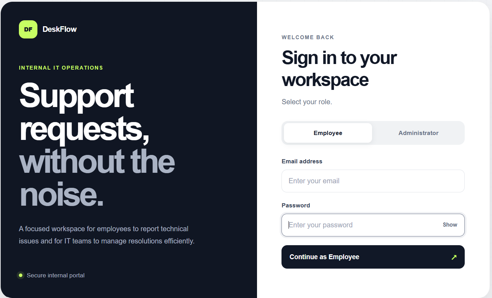
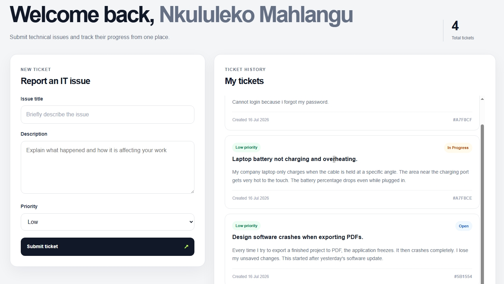
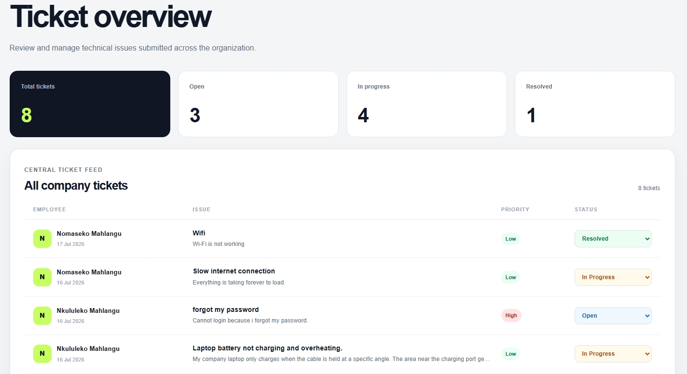

# 🎫 DeskFlow


A modern Help Desk Ticket Management System built with the **MERN** stack (MongoDB, Express.js, React, Node.js). DeskFlow allows employees to submit support tickets while providing administrators with tools to manage, track, and resolve requests efficiently.

## 🌐 Live Demo

* **Frontend:** https://deskflow-dskh.onrender.com
* **Backend API:** https://deskflow-api-6nrt.onrender.com

---

## 📖 Overview

DeskFlow is a role-based ticket management application designed to streamline internal support requests.

Employees can:

* Log in securely
* Create support tickets
* View their submitted tickets
* Track ticket status

Administrators can:

* View all submitted tickets
* Monitor ticket statistics
* Update ticket statuses
* Manage support workflow

---

# 📸 Application Screenshots

## Login Page



---

## Employee Dashboard

Features:

* Welcome dashboard
* Create new ticket
* View ticket history
* Live ticket updates



---

## Admin Dashboard

Features:

* Dashboard statistics
* View all tickets
* Update ticket status
* Manage support requests



---

## ✨ Features

### Authentication

* Mock JWT Authentication
* Role-based authorization
* Protected routes
* Secure logout
* Persistent login session

### Employee Features

* Submit support tickets
* View personal tickets
* Track ticket progress
* Responsive interface

### Admin Features

* View all support tickets
* Update ticket status
* Dashboard overview
* Manage ticket workflow

### Ticket Management

* Create tickets
* Read tickets
* Update ticket status
* Priority levels
* Status tracking

---

## 🛠️ Tech Stack

### Frontend

* React
* React Router
* Axios
* Bootstrap
* CSS3

### Backend

* Node.js
* Express.js
* MongoDB Atlas
* Mongoose
* JSON Web Token (JWT)

### Development Tools

* Git & GitHub
* Postman
* Render
* VS Code

---

## 📁 Project Structure

```text
DeskFlow/
├── backend/
│   ├── config/
│   ├── controllers/
│   ├── middleware/
│   ├── models/
│   ├── routes/
│   └── server.js
│
├── frontend/
│   ├── src/
│   │   ├── components/
│   │   ├── pages/
│   │   ├── services/
│   │   └── App.jsx
│   └── public/
│
└── README.md
```

---

## 🔐 Demo Credentials

### Employee

```text
Email:
nkululeko.mahlangu@deskflow.com

Password:
nkululeko123
```

### Admin

```text
Email:
thabang.rakeng@deskflow.com

Password:
thabang123
```

---

## 🚀 API Endpoints

### Authentication

| Method | Endpoint          | Description |
| ------ | ----------------- | ----------- |
| POST   | `/api/auth/login` | Login user  |

### Tickets

| Method | Endpoint           | Description          |
| ------ | ------------------ | -------------------- |
| GET    | `/api/tickets`     | Retrieve tickets     |
| POST   | `/api/tickets`     | Create ticket        |
| PUT    | `/api/tickets/:id` | Update ticket status |

---

## ⚙️ Running Locally

### Clone the repository

```bash
git clone https://github.com/Sangiwe/DeskFlow.git
cd DeskFlow
```

### Backend

```bash
cd backend
npm install
npm run dev
```

### Frontend

```bash
cd frontend
npm install
npm run dev
```

---

## 🌍 Deployment

The application is deployed using **Render**.

* **Frontend:** Render Static Site
* **Backend:** Render Web Service
* **Database:** MongoDB Atlas

---

## 📚 What I Learned

This project strengthened my understanding of:

* Building RESTful APIs with Express.js
* MongoDB data modeling using Mongoose
* Authentication using JWT
* Role-based access control
* React component architecture
* API integration with Axios
* Frontend and backend deployment
* Environment variables
* Full-stack application development
* Git and GitHub workflow

---

## 🔮 Future Improvements

* User registration
* Real JWT authentication with database users
* Ticket categories
* File attachments
* Search and filtering
* Email notifications
* Ticket comments
* Dashboard analytics
* Dark mode
* Unit and integration testing

---

## 👩🏽‍💻 Author

**Sangiwe Nkwanyana**

Aspiring Full-Stack Software Developer passionate about building practical web applications and continuously learning modern software development technologies.


---

## 📄 License

This project was developed for learning.
